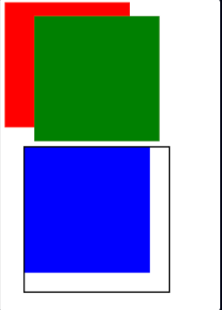

# <p align="center"> 🌸 Absolute Removal 🌸</p>

## Practice: Creating a Webpage building upon HTML basics and understanding how to use CSS Basics

### Understanding selectors and properties to bring styling with colors, fonts, sizing, layouts, and much more...

<hr>

#### Practice Understanding CSS -> Disturbing a Page's Flow with Position: Absolute

<hr>

## <p align="center">💫 Overview</p>
-   [ ] This is a CSS tutorial website that teaches the user about <b>position:absolute</b> in two parts. Part one breaks down how absolute positioning removes elements from the normal flow of the webpage and positions them relative to parent containers. Part two applies these concepts through a mock tutoring company website.

<hr>

## <p align="center">🎨 Key Design Features</p>
-   [ ] <b> Cherry Blossom theme for the color scheme across both pages </b>
-   [ ] <b> Gradient Dividers </b> between sections
-   [ ] <b> Flexbox layout </b> for header and footer alignment
-   [ ] <b> Interactive elements </b> (expandable notification, contact form)
-   [ ] <b> Consistent styling </b> across both pages through a single CSS file (style.css)

<hr>

-   [ ] Simple practice to gain a better understanding of the power of adding CSS Styling to a webpage and how it can make it uniquely beautiful
    -   [ ] CSS or Cascading Style Sheet, is a language that paints a website with colors, fonts, layouts, and animations.
    -   [ ] CSS is used to create stunning webpages.
    -   [ ] It can enhance the user experience, and can make a webpage unquie and stand out amongst the rest.
    -   [ ] It is absolutely beautiful to see a webpage come to life and become even more beautiful.

<hr>

-   [ ] CSS - Absolute Positioning:
    -   [ ] position absolute:
        -   [ ] This will break an element out of the normal flow of a webpage
        -   [ ] Giving that element a "top", "right", "bottom", and/or "left" property will place is according to the top-left of its closest non-static element.

    -   [ ] For instance, this is the syntax for static elements:
        ``` html
        <body>
            <div id="red"></div>

            <div id="outer-div">
                <div id="blue"></div>
            </div>

            <div id="green"></div>
        </body>
        ```

    -   [ ] Examples of setting absolute and relative positions of the &lt;div&gt; elements:
        ``` css
        body {
            width: 100%;
            height: 100vh;
        }

        div {
            width: 200px;
            height: 200px;
        }

        #red {
            background-color: red;
        }

        #outer-div {
            padding: 15px;
            border: 2px solid;
            position: relative;
            top: 30px;
            left: 30px;
        }

        #blue {
            background-color: blue;
            position: absolute;
            top: 0;
            left: 0;
        }

        #green {
            background-color: green;
            position: absolute;
            top: 30px;
            left: 55px;
        }
        ```

    -   [ ] #blue element -> positioned relative to #outer-div (its positioned parent)
    -   [ ] #green element -> positioned relative to the &lt;body&gt; (no positioned parent)

    -   [ ] The visual example of absolute positioning: 

<hr>

## <p align="center">&lt;/&gt; Semantic Outline of the webpage</p>

-   [ ] The &lt;header&gt; element:
    -   [ ] Is used for the beginning of the webpage
    -   [ ] Houses the title of the webpage along with Logos
    -   [ ] The &lt;figure&gt; element:
        -   [ ] Usually holds an image, illustration, diagram, code snippets, etc...
        -   [ ] It can also hold more than one
    -   [ ] The &lt;img&gt; element:
        -   [ ] Is used for all the images on the webpage

-   [ ] The &lt;nav&gt; element:
    -   [ ] This element tends to contain ordered lists, unordered lists, or even both types of lists
    -   [ ] Each &lt;li&gt; element will house an &lt;a&gt; elements with the #id-name of the desired section or part of the webpage it will be linked within the "href" attribute
        -   [ ] For instance:
            -   [ ] &lt;a href="#desired-section"&gt;🌸 Desired Section🌸&lt;/a&gt;
            -   [ ] <a href="#desired-section">🌸 Desired Section 🌸</a>
                -   [ ] When the user would click the 🌸 Desired Section 🌸 link they would then be navigated to that section of the webpage

-   [ ] The &lt;br&gt; element:
    -   [ ] Creates a new line in your code and forces whatever comes after to start on a new lin

-   [ ] The &lt;hr&gt; element:
    -   [ ] Adds a horizontal line or dividing line across the webpage
    -   [ ] Used to separate sections or different topics on a webpage

-   [ ] The &lt;main&gt; element:
    -   [ ] Is where the main information of the webpage will go
    -   [ ] The &lt;section&gt; element:
        -   [ ] This groups together pieces of similar information
    -   [ ] The &lt;article&gt; element:
        -   [ ] This will house a singular piece of information describing what this section is about in great detail

-   [ ]  The &lt;footer&gt; element:
    -   [ ]  This element tends to finish off the webpage as it is located at the very bottom of the webpage and is the last set of items that will be seen
    -   [ ] For instance:
        -   [ ] A footnote on the webpage
        -   [ ] Links to different sections of the webpage
        -   [ ] A copyright symbol for copyright information
            -   [ ] & copy; -> is the symbol for copyright
        -   [ ] A link to external sources using the "href" attribute of the &lt;a&gt; element for the links in the list item to external sources
            -   [ ] &lt;a href="/privacy"&gt;Privacy&lt;/a&gt;
                -   [ ] Use the target attribute to open the link path in a new tab instead of the current page
                -   [ ] <a href="/privacy" target="_blank">Privacy</a>
                -   [ ] When the user clicks one of these external links, they would be redirected to a new page with the informat ion

<hr>

## <p align="center">✨ Encompassed Technologies</p>
-   [ ] HTML:
    -   [ ] Will be the structure and skeleton of how the app will appear on the webpageWill be the structure and skeleton of how the app will appear on the webpage
-   [ ] CSS:
    -   [ ] Encompass the style of the app and give it some flair

